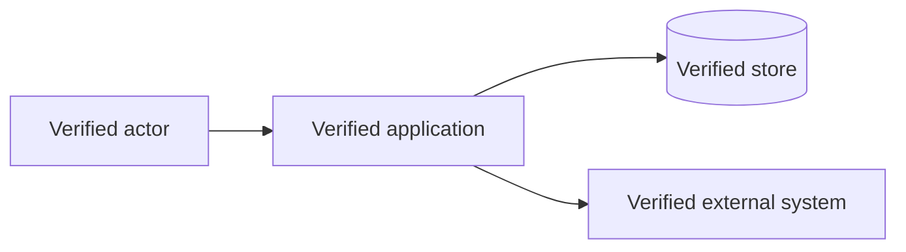
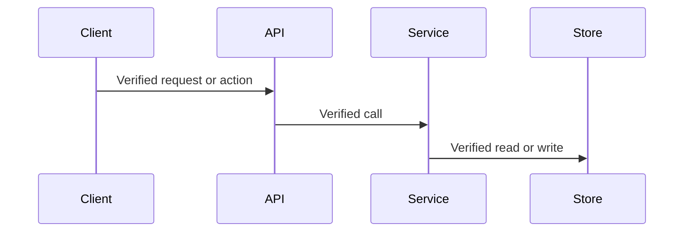
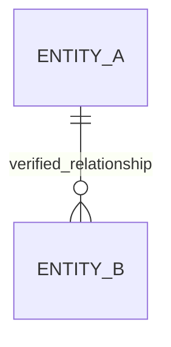
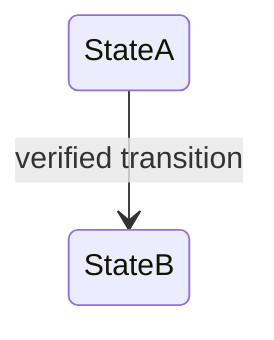

# Adaptable documentation templates

> **Authoritative reference:** Read this file in full after selecting outputs and before drafting. Adapt; do not copy blindly.

Use these as shape guidance. Remove irrelevant sections and preserve stronger existing structure.

## Root README

````markdown
# Project name

One factual sentence describing what the project is and who or what it serves.

## Overview

- Verified capability
- Verified capability

## Prerequisites

List only evidenced runtimes, package managers, services, and versions.

## Quick start

```sh
# declared commands
```

State how to verify success.

## Common commands

| Command | Purpose | Source |
|---|---|---|

## Documentation

- [Getting started](docs/getting-started.md)
- [Architecture](docs/architecture.md)

## Contributing

Link to `CONTRIBUTING.md`.

## License

Use the repository's actual license or omit this section when unknown.
````

## Architecture

````markdown
# Architecture

## System context

Describe verified external actors and systems.

## Components

| Component | Responsibility | Key paths |
|---|---|---|

## Primary flows

Describe request, event, or data flows in numbered steps. Apply `diagram-guidelines.md`; add a small Mermaid diagram only when the decision gate passes, every edge is evidenced, and companion text remains present.

## Boundaries and dependencies

Explain dependency direction, shared packages, persistence, and integrations.

## Runtime topology

Document processes and services only when runtime configuration proves them.

## Known uncertainties

Record material gaps that maintainers should clarify.
````

## Getting started

````markdown
# Getting started

## Prerequisites
## Install dependencies
## Configure the environment
## Start required services
## Run the application
## Verify the setup
## Troubleshooting
````

## Configuration

````markdown
# Configuration

## Loading and precedence

Explain where configuration is loaded and which source wins, if verified.

## Environment variables

| Variable | Required | Default | Purpose | Source |
|---|---:|---|---|---|

Never include real values. Use `—` when no default is proven.
````

## API reference

````markdown
# API reference

## Conventions

Document base paths, content types, authentication, and error shape only when verified.

## Endpoints

| Method | Path | Purpose | Auth | Handler/source |
|---|---|---|---|---|

For each important endpoint, describe validated inputs and outputs from schemas or types. Link to generated OpenAPI or GraphQL docs rather than copying large unstable schemas.
````

## Project structure

````markdown
# Project structure

```text
repo/
├── src/        # verified purpose
└── tests/      # verified purpose
```

## Major directories

| Path | Purpose | Notes |
|---|---|---|

## Generated and external content

Identify build outputs, generated sources, vendor code, fixtures, and caches.
````

## Development

````markdown
# Development

## Local workflow
## Build
## Test
## Lint and format
## Debugging
## Code generation
## CI checks
````


## Conditional diagram patterns

Use these only after the diagram decision gate passes. Replace every generic label with repository terminology and include evidence in nearby prose or tables.

### System or component context

````markdown

````

### Cross-component sequence

````markdown

````

### Entity relationships

````markdown

````

### State lifecycle

````markdown

````

Do not copy these examples as repository facts. Omit a diagram when the repository does not provide sufficient evidence.

## Completion report

Outside repository files, summarize:

- Files created or updated.
- Diagrams created, updated, retained, removed, or intentionally omitted.
- Important verified facts documented.
- Validation performed and commands actually executed.
- Remaining inferences, conflicts, or missing information.
